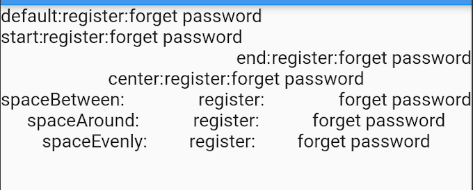

# Stack

层叠组件

# IndexedStack

层布局控件， 可以在一个控件上面放置另一个控件，IndexedStack在同一时刻只能显示子控件中的一个控件，通过Index属性来设置显示的控件。

# Column&Row

行布局组件、列布局组件

Row的布局有六个步骤，这种布局表现来自Flex（Row和Column的父类）：

1. 首先按照不受限制的主轴（main axis）约束条件，对flex为null或者为0的child进行布局，然后按照交叉轴（ cross axis）的约束，对child进行调整；
2. 按照不为空的flex值，将主轴方向上剩余的空间分成相应的几等分；
3. 对上述步骤flex值不为空的child，在交叉轴方向进行调整，在主轴方向使用最大约束条件，让其占满步骤2所分得的空间；
4. Flex交叉轴的范围取自子节点的最大交叉轴；
5. 主轴Flex的值是由mainAxisSize属性决定的，其中MainAxisSize可以取max、min以及具体的value值；
6. 每一个child的位置是由mainAxisAlignment以及crossAxisAlignment所决定。

## MainAxisAlignment

start，center，end，spaceBetween，spaceAround，spaceEvenly

# PreferredSizeWidget

# WillPopScope：导航返回拦截

