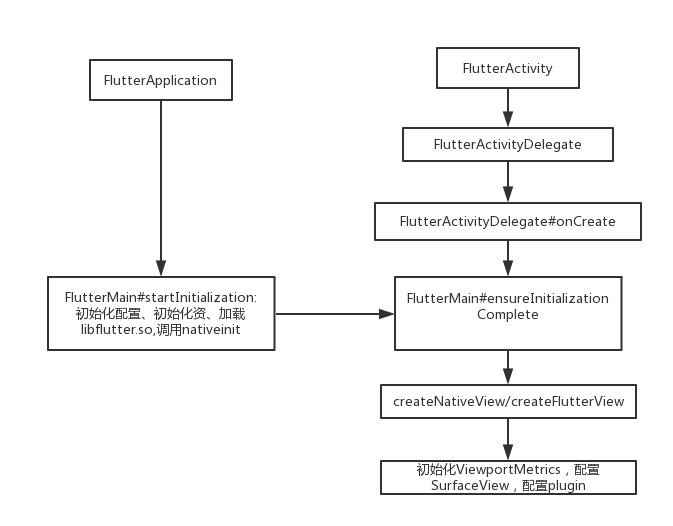

# 1、FlutterActivity

## 构造函数

```
public class FlutterActivity extends Activity implements Provider, PluginRegistry, ViewFactory {
    //创建FlutterActivityDelegate
    private final FlutterActivityDelegate delegate = new FlutterActivityDelegate(this, this);
    private final FlutterActivityEvents eventDelegate;
    private final Provider viewProvider;
    private final PluginRegistry pluginRegistry;
    
    //FlutterActivityDelegate实现了这三个接口，并赋值给三个变量，这样调用起来更加清晰
    public FlutterActivity() {
        this.eventDelegate = this.delegate;
        this.viewProvider = this.delegate;
        this.pluginRegistry = this.delegate;
    }
}
```

## onXxxx

Create、onResume、onStop、onDestory、onPause、onNewIntent、onStart、onActivityResult、onRequestPermissionResult

```
//都是由创建FlutterActivityDelegate代理执行
protected void onXxxx() {
    super.onXxxx();
    eventDelegate.onXxxx();
}
```

## 创建FlutterView

```
// 有关的函数，只有这个由FlutterActivityDelegate代理执行
public FlutterView getFlutterView() {
    return viewProvider.getFlutterView();
}

public FlutterView createFlutterView(Context context) {
    return null;
}

public FlutterNativeView createFlutterNativeView() {
    return null;
}

public boolean retainFlutterNativeView() {
    return false;
}
```

值得注意的是这里的三个回调，表示FlutterView是如何创建出来的。

## 总结

- FlutterActivity的生命周期和各个方法实际上由FlutterActivityDelegate代理执行。
- 从Activity的源码来看，已经清晰的看出FlutterActivity解决了生命周期的回调，插件管理，创建FlutterView以及相关的ui

# 2、FlutterView.Provider

```
public class FlutterView extends SurfaceView implements BinaryMessenger, TextureRegistry {
    public interface Provider {
        FlutterView getFlutterView();
    }
}
```


# 3、FlutterActivityDelegate.ViewFactory

```
public final class FlutterActivityDelegate implements FlutterActivityEvents, Provider, PluginRegistry {
    public interface ViewFactory {
        FlutterView createFlutterView(Context var1);

        FlutterNativeView createFlutterNativeView();

        boolean retainFlutterNativeView();
    }
}
```

# 4、PluginRegistry

# 5、FlutterActivityDelegate

## onCreate

```
public void onCreate(Bundle savedInstanceState) {
    if (Build.VERSION.SDK_INT >= Build.VERSION_CODES.LOLLIPOP) {
        Window window = activity.getWindow();
        window.addFlags(LayoutParams.FLAG_DRAWS_SYSTEM_BAR_BACKGROUNDS);
        window.setStatusBarColor(0x40000000);
        window.getDecorView().setSystemUiVisibility(PlatformPlugin.DEFAULT_SYSTEM_UI);
    }

		// 启动参数解析
    String[] args = getArgsFromIntent(activity.getIntent());
    //等待并保证初始化完成
    FlutterMain.ensureInitializationComplete(activity.getApplicationContext(), args);
    // 创建flutterView,注意到上面默认的返回null
    flutterView = viewFactory.createFlutterView(activity);
    if (flutterView == null) {
        // 默认走这里,createFlutterNativeView默认返回null
        FlutterNativeView nativeView = viewFactory.createFlutterNativeView();
        // 实际创建了FlutterView
        flutterView = new FlutterView(activity, null, nativeView);
        // 设置layout，并添加到当前activity，作为主视图
        flutterView.setLayoutParams(matchParent);
        activity.setContentView(flutterView);
        //创建启动ui
        launchView = createLaunchView();
        if (launchView != null) {
            
            addLaunchView();
        }
    }

    if (loadIntent(activity.getIntent())) {
        return;
    }

    String appBundlePath = FlutterMain.findAppBundlePath(activity.getApplicationContext());
    if (appBundlePath != null) {
        runBundle(appBundlePath);
    }
}
```
FlutterMain.ensureInitializationComplete
```
public static void ensureInitializationComplete(@NonNull Context applicationContext, @Nullable String[] args) {
		// 保证ui线程运行
    if (Looper.myLooper() != Looper.getMainLooper()) {
      throw new IllegalStateException("ensureInitializationComplete must be called on the main thread");
    }
    if (sSettings == null) {
      throw new IllegalStateException("ensureInitializationComplete must be called after startInitialization");
    }
    if (sInitialized) {
        return;
    }
    try {
        // 等待完成，这里有个疑问点，sResourceExtractor是什么时候创建的
        if (sResourceExtractor != null) {
            sResourceExtractor.waitForCompletion();
        }
        // 继续解析参数
        List<String> shellArgs = new ArrayList<>();
        shellArgs.add("--icu-symbol-prefix=_binary_icudtl_dat");

        ApplicationInfo applicationInfo = getApplicationInfo(applicationContext);
        shellArgs.add("--icu-native-lib-path=" + applicationInfo.nativeLibraryDir + File.separator + DEFAULT_LIBRARY);

        if (args != null) {
            Collections.addAll(shellArgs, args);
        }

        String kernelPath = null;
        if (BuildConfig.DEBUG) {
            String snapshotAssetPath = PathUtils.getDataDirectory(applicationContext) + File.separator + sFlutterAssetsDir;
            kernelPath = snapshotAssetPath + File.separator + DEFAULT_KERNEL_BLOB;
            shellArgs.add("--" + SNAPSHOT_ASSET_PATH_KEY + "=" + snapshotAssetPath);
            shellArgs.add("--" + VM_SNAPSHOT_DATA_KEY + "=" + sVmSnapshotData);
            shellArgs.add("--" + ISOLATE_SNAPSHOT_DATA_KEY + "=" + sIsolateSnapshotData);
        } else {
            shellArgs.add("--" + AOT_SHARED_LIBRARY_NAME + "=" + sAotSharedLibraryName);
        }

        shellArgs.add("--cache-dir-path=" + PathUtils.getCacheDirectory(applicationContext));
        if (sSettings.getLogTag() != null) {
            shellArgs.add("--log-tag=" + sSettings.getLogTag());
        }
        // 查找bundle
        String appStoragePath = PathUtils.getFilesDir(applicationContext);
        // native初始化，参数为解析的所有启动参数和一个bundle的路径
        String engineCachesPath = PathUtils.getCacheDirectory(applicationContext);
        FlutterJNI.nativeInit(applicationContext, shellArgs.toArray(new String[0]),
            kernelPath, appStoragePath, engineCachesPath);

        sInitialized = true;
    } catch (Exception e) {
        Log.e(TAG, "Flutter initialization failed.", e);
        throw new RuntimeException(e);
    }
}
```

路径

```
private static final String DEFAULT_AOT_SHARED_LIBRARY_NAME = "libapp.so";
private static final String DEFAULT_VM_SNAPSHOT_DATA = "vm_snapshot_data";
private static final String DEFAULT_ISOLATE_SNAPSHOT_DATA = "isolate_snapshot_data";
private static final String DEFAULT_LIBRARY = "libflutter.so";
private static final String DEFAULT_KERNEL_BLOB = "kernel_blob.bin";
private static final String DEFAULT_FLUTTER_ASSETS_DIR = "flutter_assets";
```

- (8)sResourceExtractor.waitForCompletion();在干什么？
- (9)new FlutterView(this.activity, (AttributeSet)null, nativeView);这里是否可以解释前面的问题（1）
- (10) nativeInit作用？bundle是什么，如何加载？

# 6、FlutterApplication

```
public class FlutterApplication extends Application {
    @Override
    @CallSuper
    public void onCreate() {
        super.onCreate();
        FlutterMain.startInitialization(this);
    }

    private Activity mCurrentActivity = null;
    public Activity getCurrentActivity() {
        return mCurrentActivity;
    }
    public void setCurrentActivity(Activity mCurrentActivity) {
        this.mCurrentActivity = mCurrentActivity;
    }
}
```

```
public static void startInitialization(@NonNull Context applicationContext) {
    startInitialization(applicationContext, new Settings());
}
```

```
public static void startInitialization(@NonNull Context applicationContext, @NonNull Settings settings) {
    if (Looper.myLooper() != Looper.getMainLooper()) {
      throw new IllegalStateException("startInitialization must be called on the main thread");
    }
    // Do not run startInitialization more than once.
    if (sSettings != null) {
      return;
    }

    sSettings = settings;

    long initStartTimestampMillis = SystemClock.uptimeMillis();
    initConfig(applicationContext);
    initResources(applicationContext);

    System.loadLibrary("flutter");

    VsyncWaiter
        .getInstance((WindowManager) applicationContext.getSystemService(Context.WINDOW_SERVICE))
        .init();

    // We record the initialization time using SystemClock because at the start of the
    // initialization we have not yet loaded the native library to call into dart_tools_api.h.
    // To get Timeline timestamp of the start of initialization we simply subtract the delta
    // from the Timeline timestamp at the current moment (the assumption is that the overhead
    // of the JNI call is negligible).
    long initTimeMillis = SystemClock.uptimeMillis() - initStartTimestampMillis;
    FlutterJNI.nativeRecordStartTimestamp(initTimeMillis);
}
```

### Setting

这里的Setting非常简单,只是提供了日志的tag,那么这个logTag在哪里用？又是一个疑问。

```
public static class Settings {
    private String logTag;

    @Nullable
    public String getLogTag() {
        return logTag;
    }

    /**
     * Set the tag associated with Flutter app log messages.
     * @param tag Log tag.
     */
    public void setLogTag(String tag) {
        logTag = tag;
    }
}
```

### initConfig

initConfig,这个函数主要用于初始化配置

```
private static void initConfig(@NonNull Context applicationContext) {
    Bundle metadata = getApplicationInfo(applicationContext).metaData;

    // There isn't a `<meta-data>` tag as a direct child of `<application>` in
    // `AndroidManifest.xml`.
    if (metadata == null) {
        return;
    }

    sAotSharedLibraryName = metadata.getString(PUBLIC_AOT_SHARED_LIBRARY_NAME, DEFAULT_AOT_SHARED_LIBRARY_NAME);
    sFlutterAssetsDir = metadata.getString(PUBLIC_FLUTTER_ASSETS_DIR_KEY, DEFAULT_FLUTTER_ASSETS_DIR);

    sVmSnapshotData = metadata.getString(PUBLIC_VM_SNAPSHOT_DATA_KEY, DEFAULT_VM_SNAPSHOT_DATA);
    sIsolateSnapshotData = metadata.getString(PUBLIC_ISOLATE_SNAPSHOT_DATA_KEY, DEFAULT_ISOLATE_SNAPSHOT_DATA);
}
```

这里可以看到flutter的定制选项，可以在androd的meta里面定义

- sAotSharedLibraryPath
- sAotVmSnapshotData
- sAotVmSnapshotInstr
- sAotIsolateSnapshotData
- sAotIsolateSnapshotInstr
- sFlx
- sSnapshotBlob
- sFlutterAssetsDir

### initResources

```
private static void initResources(@NonNull Context applicationContext) {
    // 开始清理资源
    new ResourceCleaner(applicationContext).start();

    if (BuildConfig.DEBUG) {
        final String dataDirPath = PathUtils.getDataDirectory(applicationContext);
        final String packageName = applicationContext.getPackageName();
        final PackageManager packageManager = applicationContext.getPackageManager();
        final AssetManager assetManager = applicationContext.getResources().getAssets();
        sResourceExtractor = new ResourceExtractor(dataDirPath, packageName, packageManager, assetManager);

        // In debug/JIT mode these assets will be written to disk and then
        // mapped into memory so they can be provided to the Dart VM.
        sResourceExtractor
            .addResource(fromFlutterAssets(sVmSnapshotData))
            .addResource(fromFlutterAssets(sIsolateSnapshotData))
            .addResource(fromFlutterAssets(DEFAULT_KERNEL_BLOB));

        sResourceExtractor.start();
    }
}
```

